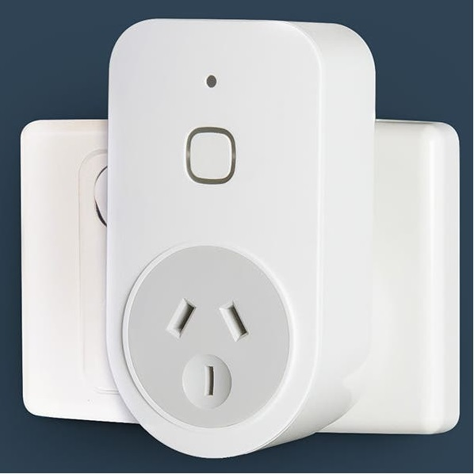
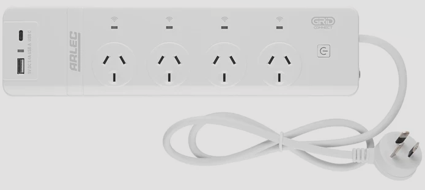
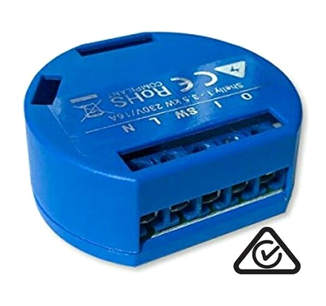
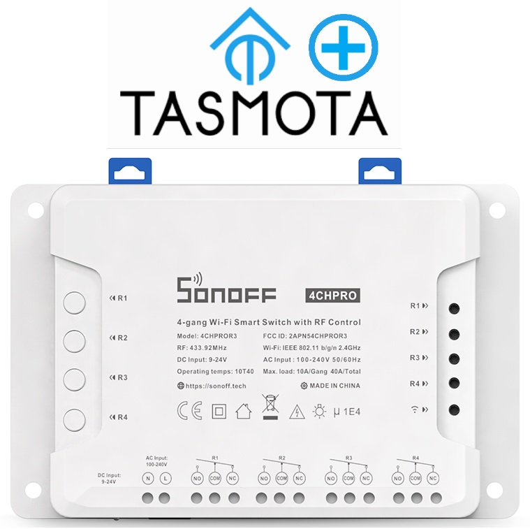

# Tasmota Plus
[UBWH](https://ubwh.com.au) has developed an enhanced version of [Tasmota](https://tasmota.github.io/docs/ "Tasmota") with additional features making it better suited for use by IT professionals.

## Why Tasmota?
[Internet of Things](https://en.wikipedia.org/wiki/Internet_of_things "IoT") (IoT) devices are Internet-connected smart appliances. 

Unfortunately, many IoT devices are controlled via a cloud server; commonly in China. Also, there is generally no way to control these devices using remote commands from (e.g.) a PHP script running on a separate computer.

Tasmota devices work differently; they are controlled via
1. the built-in Web server [GUI](https://en.wikipedia.org/wiki/Graphical_user_interface)
1. http URLs: e.g. [http://_My.IP.Address.com_/cm?cmnd=Power On]()
1. [MQTT]()
1. [openHAB]()
1. [Many others...](https://tasmota.github.io/docs/Integrations/)
  
## Why Tasmota Plus?
**Tasmota Plus** has these enhancements over Tasmota.
| Feature                        | Comment       
| :------------------------------|:-------------| 
| WAN security                   | Prevent commands being executed unless coming from a nominated IP address
| Timer configuration page       | Allowing timer controls such a 'Turn ON at Sunset plus 15 mins'
| Clock configuration page       | Allowing setting of parameters (Time zone, Daylight saving, ...) so that Real Time Clock is accurate
| WiFi signal strength indicator | Easy visualisation of WiFi signal
| Ping watchdogs                 | Enabling cycling of socket power if pings to a nominated IP address fail

## Products Available with Tasmota Plus
| Part Number                     | Description | Image       
| :------------------------------|:-------------|-------- 
| [SP-Plug-AU](https://ubwh.com.au/SP-Plug-AU) | A single-outlet, voltage and power monitoring Australian Smart Plug. | 
| [SP-Strip-AU](https://ubwh.com.au/SP-Strip-AU) | A 4-outlet Australian Smart Power Strip. | 
| [SS-1CHPro](https://ubwh.com.au/SS-1CHPro) | A 1-channel Smart Relay/Switch | 
| [SS-4CHPro](https://ubwh.com.au/SS-4CHPro) | A 4-channel Smart Relay/Switch | 
| [SG-TEMP](https://ubwh.com.au/SG-TEMP) | A Smart Temperature sensor | 
| [SG-RANGE](https://ubwh.com.au/SG-RANGE) | A Smart Ultrasonic Range Funder | 

## Firmware Downloads and Upgrade Instructions
### Firmware Download URLs

* __SP-Plug-AU__
  * https://ubwh.com.au/tasmota/Tasmota-Plus/SP-Plug-ReleaseNotes.php

* __SP-Strip-AU__
  * https://ubwh.com.au/tasmota/Tasmota-Plus/SP-Strip-ReleaseNotes.php
* __SS-1CHPro__
  * https://ubwh.com.au/tasmota/Tasmota-Plus/SS-1CHPro-ReleaseNotes.php

* __SS-4CHPro__
  * https://ubwh.com.au/tasmota/Tasmota-Plus/SS-4CHPro-ReleaseNotes.php
* __SG-TEMP__
  * https://ubwh.com.au/tasmota/Tasmota-Plus/SG-TEMP-ReleaseNotes.php
* __SG-RANGE__
  * https://ubwh.com.au/tasmota/Tasmota-Plus/SG-RANGE-ReleaseNotes.php

### Instructions
There are two ways to upgrade the firmware: 
1. __Over the Air (OTA)__
* Open the Main page of your Tasmota-Plus device
* Click __Firmware Upgrade__
* In the _OTA Url_ box enter the _Download URL_ for you device (see above)
* Click _Start upgrade_
* Your device will:
  * Download the firmware file
  * Install it
  * Reboot
* Your device will NOT:
  * Change the Settings (i.e. Configuration)
2. __Upload file__
* With your local computer: Visit the _Download URL_ for your device (see above)
* Download and save the file
* Open the Main page of your Tasmota-Plus device
* Click __Firmware Upgrade__
* Click __Choose file__
* Select the file just downloaded
* Click __Start upgrade__

